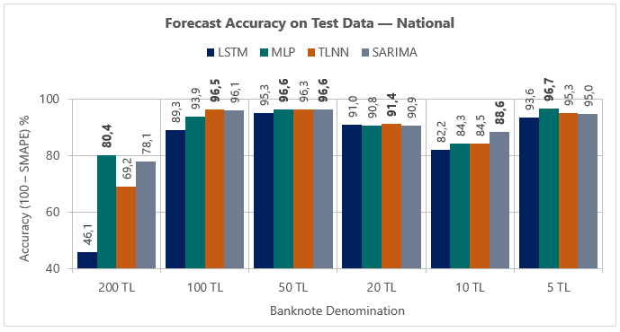
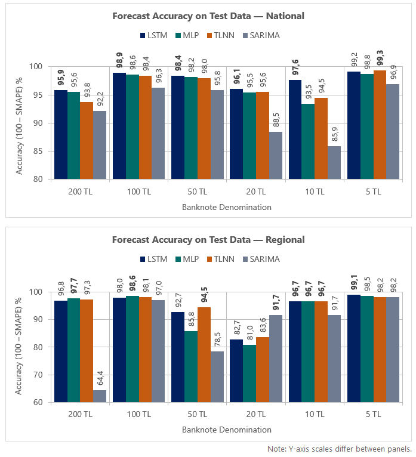
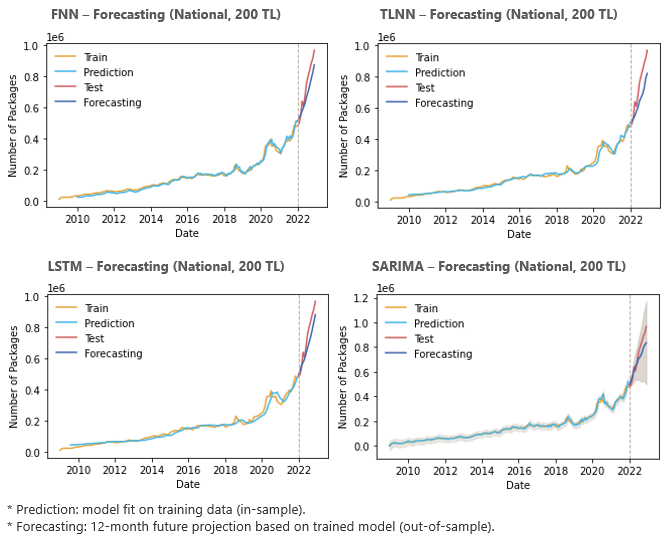
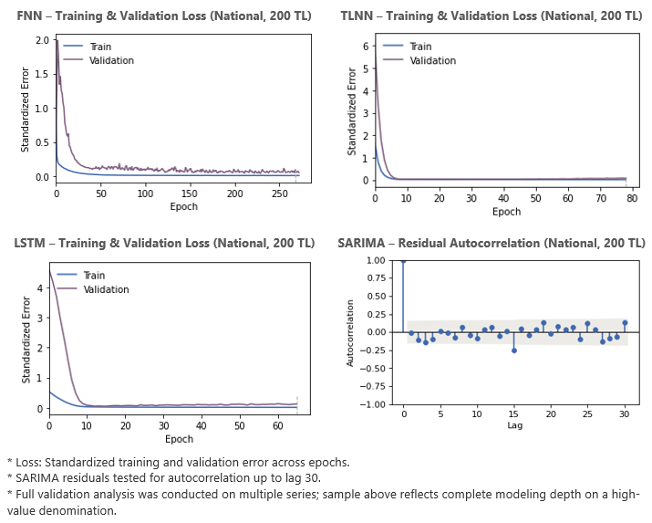
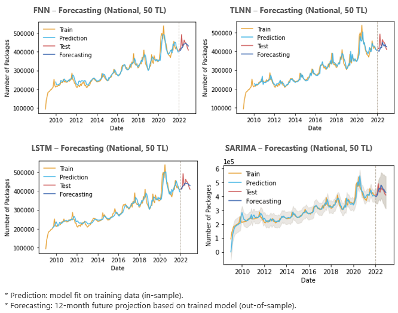
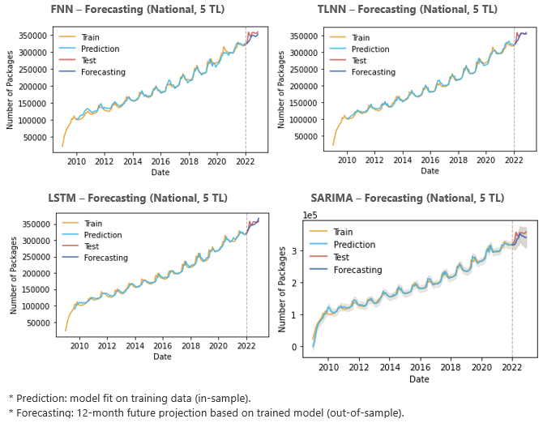
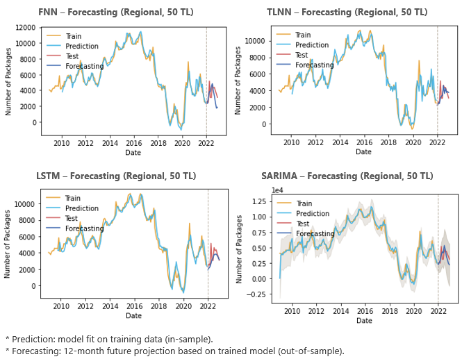
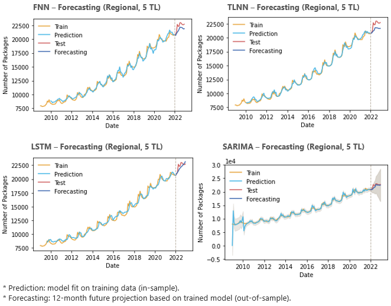

# AI-Driven Banknote Forecasting System

## 🔍 Overview  

Forecasting banknote demand is a critical challenge for central banks, since banknotes in circulation depend on many external and macroeconomic factors.  

This AI-driven system addresses the problem by using a dual-path forecasting architecture, combining time-series models for structural interpretability with neural networks for adaptive learning.  

Originally developed and validated as a high-impact prototype at the Central Bank of the Republic of Türkiye, it was applied to **48 models** across **real-world national and regional datasets**. Due to confidentiality constraints, only the **24 national-scale models** are shared in this public repository.  

It achieved median-based forecast accuracies up to **97%** (1−SMAPE), delivering strategic insights that supported monetary stability and efficient banknote management.  

---

## ✨ Key Features  

- **Hybrid forecasting architecture (SARIMA + Neural Networks)**  
  Machine learning (LSTM, MLP/FNN, TLNN) and time series (SARIMA) models; applied to six denominations (₺5…₺200) at national scale, resulting in 24 trained and validated models (4 × 6).  
  All models were evaluated under a consistent, leakage-safe protocol with **train / validation / test splits using past-only windows**.  

- **Robustness over single-run performance**  
  Neural networks were trained with multiple random seeds, and results were reported using **median-seed performance** rather than isolated "best runs".  
  This ensured that **model selection favored stability and decision reliability**, not just peak accuracy.  

- **Training & modeling safeguards**  
  Neural networks: early stopping, loss monitoring, learning-rate scheduling, regularization techniques to prevent overfitting, deterministic initializers for reproducibility, and normalization for stable training.  
  Time series: stationarity/seasonality checks, model selection, and residual diagnostics to ensure robustness and validity.  
  Together, these mechanisms ensured **smooth convergence**, **generalization beyond the training period**, and **consistent behavior across multiple runs**.   

 - **Metrics & interpretability**  
  RMSE to assess errors in real-world units (domain-level interpretability).  
  SMAPE as the main reporting metric, also expressed as accuracy (100 − SMAPE) for clear comparison and communication.  
  Additional stability indicators such as NRMSE and seed-based CV/IQR included to reflect consistency rather than isolated peak scores.  

---

## 📊 Real-World Impact  

- **Actionable accuracy & decision support**  
  Median-based forecast accuracies up to 97% (SMAPE), delivering reliable insights for both national and regional allocation decisions.  

- **Practical by design**  
  Forecasts relied only on the banknote demand series itself — no external variables required.  
  This made the system easy to set up and directly usable in practice, while still achieving high accuracy.  

- **Supports both short-term response and long-term planning**  
  Produced 12-month forecasts with confidence intervals, helping decision-makers prepare for seasonal patterns.  
  Supported not only cash logistics but also upstream needs such as banknote production, supply chain preparation, and long-term stock management.  

**SARIMA provided a stable statistical baseline, while neural networks added adaptive gains—especially in volatile denominations—offering more reliable signals for allocation decisions.**  

  

---

## 📂 Project Files & Notebooks  

All notebooks are stored in the [`/notebooks`](./notebooks) folder.  
They include **both source code and final outputs (forecasts, validation plots, diagnostics)** — no need to re-run to view results. 

- **Artificial Neural Networks (MLP / TLNN / LSTM)**  
  Full training, validation, loss monitoring and forecasting outputs are available in a single consolidated notebook:  
  👉 **[Open Reproducible ANN Notebook](https://www.kaggle.com/code/shakkutlu/ai-driven-demand-forecasting-mlp-tlnn-lstm)**

- **SARIMA (classical time-series baseline)**  
  Includes national-scale forecasts for all denominations, along with residual diagnostics and confidence interval projections:  
  👉 **[Open Reproducible SARIMA Notebook](https://www.kaggle.com/code/shakkutlu/time-series-demand-forecasting-sarima)**

> *The original prototype also included 24 regional-scale models trained under the same protocol, but these are not included in this public release due to confidentiality constraints.*

---

## ⚙️ Tools & Environment  

- **Language:** Python (tested with 3.7+)  
- **Core libraries:** TensorFlow, Keras, Pandas, NumPy, Scikit-learn  
- **Time series:** Statsmodels, pmdarima  
- **Visualization:** Matplotlib  
- **Environment:** Jupyter Notebook  

---

## 📦 Reproduction Guide  

All notebooks can be opened directly on Kaggle — no local setup required. They run in Kaggle’s hosted Python environment.

Open the Kaggle notebooks (links provided below).  
- National-level notebooks are fully reproducible with public datasets.
- Regional-level notebooks are limited to aggregated outputs and metrics (raw data not included).

### 🔗 Kaggle Notebooks  

- **Artificial Neural Networks (per denomination)** 
  - National scale (₺5 … ₺200): [200₺](link) · [100₺](link) · [50₺](link) · [20₺](link) · [10₺](link) · [5₺](link)  
  - Regional scale (₺5 … ₺200): [200₺](link) · [100₺](link) · [50₺](link) · [20₺](link) · [10₺](link) · [5₺](link)  

- **SARIMA (per scale)**  
  - National scale: [all denominations](link)  
  - Regional scale: [all denominations](link)  

---

## 🛡️ Disclaimer  

- The notebooks are **anonymized, demonstration-ready versions** prepared for portfolio purposes.  
- **No confidential or sensitive data are included.**  
  - National-level datasets are public.  
  - Regional-level datasets are not shared.  

 

## Visual Results
Below are selected visuals demonstrating the forecasting performance and evaluation results of the AI-based system across different models, denominations, and regions.

### Evaluation Metrics – National vs Regional (SMAPE %)
- Evaluation of 4 models across 6 denominations using SMAPE as the main metric.
- AI models (LSTM, TLNN, FNN) generally outperformed SARIMA at both national and regional levels.

---

### Forecasting Results – National Level
#### Forecasting – National Level (200 TL)
- Trained on historical demand data and projected 12 months ahead.
- FNN and LSTM delivered more accurate projections during the test period (2022), closely tracking real demand.
- TLNN and SARIMA showed weaker generalization during unexpected surges.

---

#### Loss Curves & Residual Autocorrelation – National Level (200 TL)
- The 200 TL models show stable convergence in both training and validation losses across all neural networks.
- SARIMA's residuals showed no significant autocorrelation.
- These help assess overfitting and model consistency, with early stopping applied to the neural models to retain optimal performance.

---

#### Forecasting – National Level (50 TL)
- Strong seasonal signals were observed and well tracked by neural models.
- SARIMA captured the overall trend but with less precision and higher uncertainty.

---

#### Forecasting – National Level (5 TL)
- All models captured seasonal demand patterns.
- Neural models (LSTM, TLNN, FNN) showed slightly better alignment with actual trends than SARIMA, which had wider forecast uncertainty.

---

### Forecasting Results – Regional Level

#### Forecasting – Regional Level (200 TL)
- FNN, LSTM, and TLNN maintained accuracy despite regional volatility.
- SARIMA underperformed in capturing irregular demand fluctuations.

---

#### Forecasting – Regional Level (50 TL)
- LSTM and TLNN maintained accuracy despite regional volatility.
- SARIMA and FNN underperformed in capturing irregular demand fluctuations.

---

#### Forecasting – Regional Level (5 TL)
- All models followed the regional demand trend with clear seasonality.
- Neural networks closely tracked actual values, though with slight underestimation across most months.
- SARIMA showed higher forecast variance and slightly less stable fit.

---

## Implementation
To explore the project in detail, including 12 distinct datasets and 14 Jupyter notebooks used for training and forecasting AI and time series models with national and regional data, please visit the Kaggle repository:

1. [200 TL – National Forecasting (FNN, TLNN, LSTM)](https://www.kaggle.com/code/shakkutlu/vocational-thesis-ai-ann-tr-200)
2. [100 TL – National Forecasting (FNN, TLNN, LSTM)](https://www.kaggle.com/code/shakkutlu/vocational-thesis-ai-ann-tr-100)
3. [50 TL – National Forecasting (FNN, TLNN, LSTM)](https://www.kaggle.com/code/shakkutlu/vocational-thesis-ai-ann-tr-50)
4. [20 TL – National Forecasting (FNN, TLNN, LSTM)](https://www.kaggle.com/code/shakkutlu/vocational-thesis-ai-ann-tr-20)
5. [10 TL – National Forecasting (FNN, TLNN, LSTM)](https://www.kaggle.com/code/shakkutlu/vocational-thesis-ai-ann-tr-10)
6. [5 TL – National Forecasting (FNN, TLNN, LSTM)](https://www.kaggle.com/code/shakkutlu/vocational-thesis-ai-ann-tr-5)
7. [200 TL – Regional Forecasting (FNN, TLNN, LSTM)](https://www.kaggle.com/code/shakkutlu/vocational-thesis-ai-ann-eskisehir-200)
8. [100 TL – Regional Forecasting (FNN, TLNN, LSTM)](https://www.kaggle.com/code/shakkutlu/vocational-thesis-ai-ann-eskisehir-100)
9. [50 TL – Regional Forecasting (FNN, TLNN, LSTM)](https://www.kaggle.com/code/shakkutlu/vocational-thesis-ai-ann-eskisehir-50)
10. [20 TL – Regional Forecasting (FNN, TLNN, LSTM)](https://www.kaggle.com/code/shakkutlu/vocational-thesis-ai-ann-eskisehir-20)
11. [10 TL – Regional Forecasting (FNN, TLNN, LSTM)](https://www.kaggle.com/code/shakkutlu/vocational-thesis-ai-ann-eskisehir-10)
12. [5 TL – Regional Forecasting (FNN, TLNN, LSTM)](https://www.kaggle.com/code/shakkutlu/vocational-thesis-ai-ann-eskisehir-5)
13. [SARIMA – National Forecasting (All Denominations)](https://www.kaggle.com/code/shakkutlu/vocational-thesis-time-series-sarima-tr-data)
14. [SARIMA – Regional Forecasting (All Denominations)](https://www.kaggle.com/code/shakkutlu/vocational-thesis-time-series-sarima-eskisehir)

## Official Publication
The official thesis detailing this project is published on the CBRT website:

[View the full publication (PDF, in Turkish)](https://www.tcmb.gov.tr/wps/wcm/connect/b6bafef0-4d5f-4077-9497-e35e2b38c272/Uzmanl%C4%B1k+Tezi+-+%C4%B0shak+Kutlu.pdf?MOD=AJPERES&CACHEID=ROOTWORKSPACE-b6bafef0-4d5f-4077-9497-e35e2b38c272-oMkQrtC)
